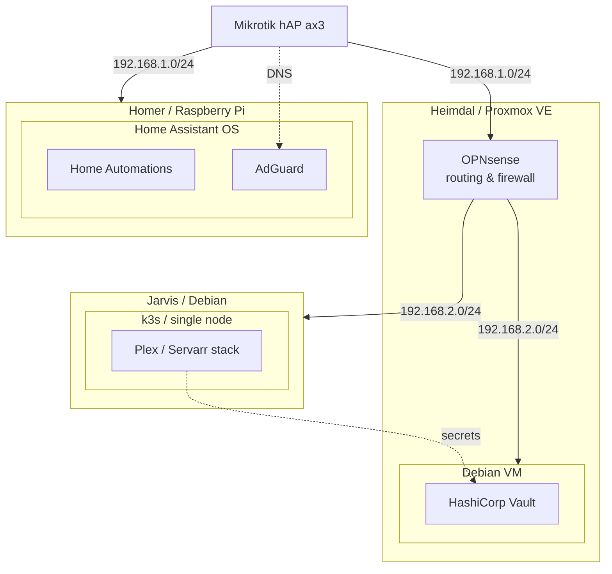

# Automating things I refuse to do twice

Senior .NET / Backend engineer

A lot of what I build in my spare time starts with something in my homelab annoying me more than once.

---

## Cleanuparr

An advanced download manager for the Servarr ecosystem built on the latest version of .NET, with a REST API, Quartz.NET background workers, and a modern UI built with the latest version of Angular. Available for Docker, Linux, Windows, and macOS.

---

## Homelab

